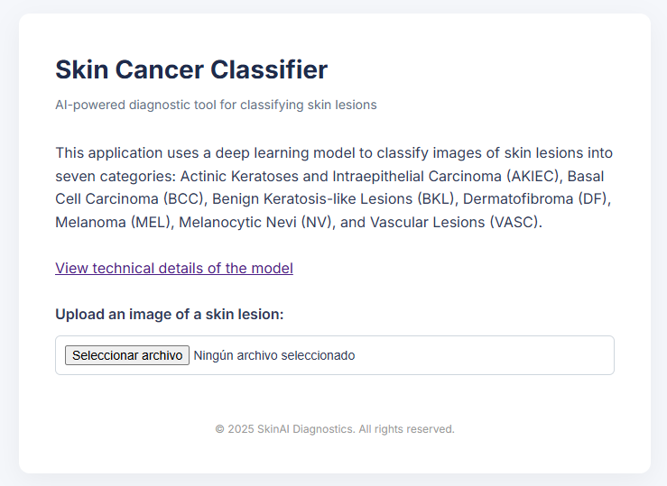
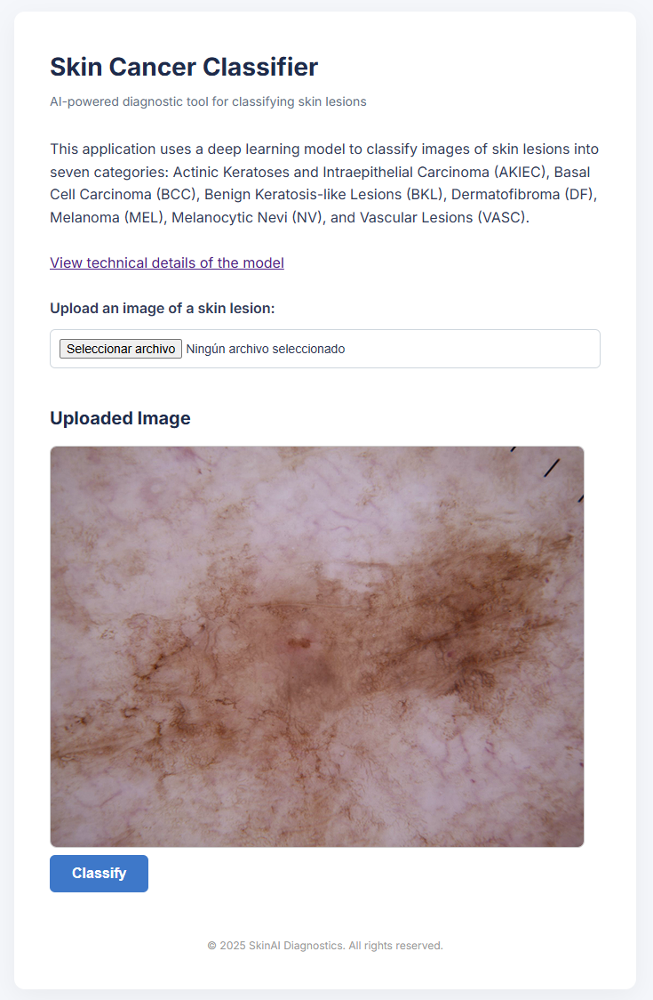
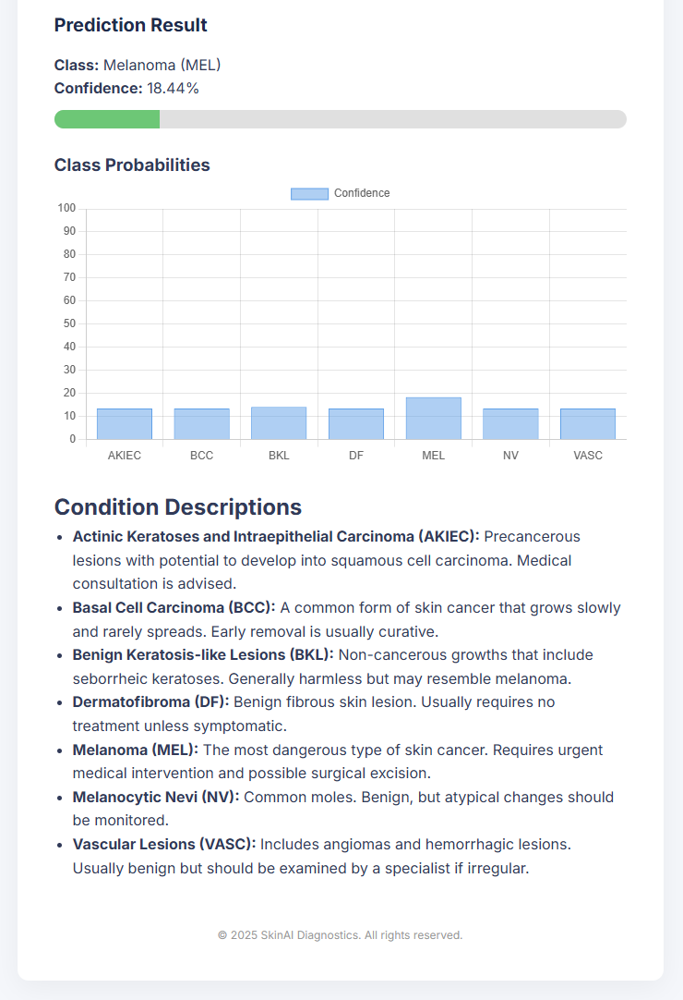

# Skin Cancer Classifier API

**SkinAI Diagnostics**  
A FastAPI web application for skin cancer image classification using deep learning.

---

## Project Overview

This repository provides a professional web interface for skin cancer classification, based on the best-performing model from the academic project [Skin Cancer XAI - Universidad](https://github.com/miguelplana764/skin-cancer-xai-universidad), developed as part of a master's degree assignment at the University of Alicante. The original work focused on replicating and improving the results of [An Interpretable Deep Learning Approach for Skin Cancer Categorization](https://github.com/faysal-md/an-interpretable-deep-learning-approach-for-skin-cancer-categorization-ieee2023), with emphasis on model calibration and interpretability.

This application allows users—especially in the medical field—to easily upload skin lesion images and obtain reliable predictions, complete with confidence scores and technical details about the underlying model.

---

## Repository Structure

```
skin-cancer-api/
├── app/
│   ├── main.py                # FastAPI application entry point
│   ├── predict.py             # Image preprocessing and prediction logic
│   ├── model_loader.py        # Loads the trained EfficientNetV2S model
│   ├── model/                 # Local model storage (auto-downloaded if missing)
│   │   └── efficientnetv2s.h5 # Pretrained model file
│   ├── static/
│   │   └── style.css          # Custom CSS for the web interface
│   ├── templates/
│   │   ├── main.html          # Main page template
│   │   └── model_info.html    # Model technical details template
│   └── uploads/               # Uploaded images (auto-created)
├── test_images/               # Sample images for testing the app
│    └── ... 
├── README_images/             # Screenshots for README tutorial
│   ├── first_sight.png
│   ├── uploaded_image.png
│   └── prediction_result.png
├── requirements.txt           # Python dependencies
├── Dockerfile                 # Docker setup for deployment
├── .dockerignore              # Docker ignore rules
└── README.md                  # Project documentation (this file)
```

---

## Features

- **Skin Cancer Classification:**  
  Classifies dermatoscopic images into seven categories:
  - Actinic Keratoses and Intraepithelial Carcinoma (AKIEC)
  - Basal Cell Carcinoma (BCC)
  - Benign Keratosis-like Lesions (BKL)
  - Dermatofibroma (DF)
  - Melanoma (MEL)
  - Melanocytic Nevi (NV)
  - Vascular Lesions (VASC)

- **Professional Web Interface:**  
  Built with FastAPI and Jinja2, styled for clarity and usability.

- **Model Calibration:**  
  Uses Temperature Scaling (T-scaling) to improve the reliability of predicted probabilities.

- **Technical Transparency:**  
  Includes a dedicated page with model architecture, training setup, and performance metrics.

- **Confidence Visualization:**  
  Displays both the top prediction and a probability chart for all classes.

- **Sample Images:**  
  The `test_images/` folder contains real examples from the HAM10000 dataset for easy testing.

---

## Model Details

- **Base Model:** EfficientNetV2S (20.5 million parameters)
- **Dataset:** [HAM10000](https://dataverse.harvard.edu/dataset.xhtml?persistentId=doi:10.7910/DVN/DBW86T)
- **Calibration:** Temperature Scaling (optimal T=2.77)
- **Performance:**  
  - Accuracy: 0.88
  - Macro F1-score: 0.80
  - Expected Calibration Error (ECE): 0.022 (after T-scaling)

For full technical details, see the [Model Technical Information](#model-technical-information) section or click the link in the app.

---

## Model Download from Hugging Face

The model file `efficientnetv2s.h5` is too large to be stored directly in this repository.  
Instead, it is hosted on [Hugging Face Hub](https://huggingface.co/Miguel764/efficientnetv2s-skin-cancer-classifier) and will be **automatically downloaded** the first time the application is run.

**How it works:**
- The expected file path is `app/model/efficientnetv2s.h5`.
- On startup, `app/model_loader.py` checks if the model exists locally.
- If it does not exist, it is downloaded using the `huggingface_hub` library and saved to `app/model/`.
- Once downloaded, the model is loaded from the local path in subsequent runs.

**Note for Docker users:**  
When running inside a Docker container, the downloaded model will be stored **inside the container's filesystem** and will not appear on your host machine unless you mount a volume to persist it.

You can also download it manually from this link:  
[https://huggingface.co/Miguel764/efficientnetv2s-skin-cancer-classifier](https://huggingface.co/Miguel764/efficientnetv2s-skin-cancer-classifier)

---

## Installation & Usage

### 1. Clone the Repository

```sh
git clone https://github.com/yourusername/skin-cancer-api.git
cd skin-cancer-api
```

### 2. Install Dependencies

```sh
pip install -r requirements.txt
```

> **Note:** Requires Python 3.8+ and TensorFlow 2.10.0 (GPU recommended).

### 3. Run the Application

```sh
uvicorn app.main:app --reload
```

The app will be available at [http://localhost:8000](http://localhost:8000).

### 4. Try with Sample Images

Use the images in the `test_images/` folder to test the classifier.

---

## Docker Deployment

Build and run the app in a container:

```sh
docker build -t skin-cancer-api .
docker run -p 8000:8000 skin-cancer-api
```

---

## Application Tutorial

Below is a step-by-step guide to using the web interface.  
Screenshots are provided for clarity.

### 1. First Sight



- **Description:**  
  The landing page introduces the classifier, provides a link to technical details, and allows you to upload a skin lesion image.

### 2. Uploaded Image



- **Description:**  
  After uploading, you can preview the image to confirm it was uploaded correctly. The "Classify" button appears to run the model.

### 3. Prediction Results



- **Description:**  
  The app displays:
  - The most probable class and its confidence percentage.
  - A bar chart showing probabilities for all classes.
  - Short descriptions of each skin condition, helping users interpret the results and understand the severity of each type.

---

## Model Technical Information

Click the "View technical details of the model" link in the app for full information on:

- Dataset and class definitions
- Training environment and dependencies
- Model architecture and parameter count
- Performance metrics (precision, recall, F1-score, support)
- Calibration method and ECE improvement

---

## License

````text
MIT License

Copyright (c) 2025 Miguel Plana

Permission is hereby granted, free of charge, to any person obtaining a copy
of this software and associated documentation files (the "Software"), to deal
in the Software without restriction, including without limitation the rights
to use, copy, modify, merge, publish, distribute, sublicense, and/or sell
copies of the Software, and to permit persons to whom the Software is
furnished to do so, subject to the following conditions:

The above copyright notice and this permission notice shall be included in all
copies or substantial portions of the Software.

THE SOFTWARE IS PROVIDED "AS IS", WITHOUT WARRANTY OF ANY KIND, EXPRESS OR
IMPLIED, INCLUDING BUT NOT LIMITED TO THE WARRANTIES OF MERCHANTABILITY,
FITNESS FOR A PARTICULAR PURPOSE AND NONINFRINGEMENT. IN NO EVENT SHALL THE
AUTHORS OR COPYRIGHT HOLDERS BE LIABLE FOR ANY CLAIM, DAMAGES OR OTHER
LIABILITY, WHETHER IN AN ACTION OF CONTRACT, TORT OR OTHERWISE, ARISING FROM,
OUT OF OR IN CONNECTION WITH THE SOFTWARE OR THE USE OR OTHER DEALINGS IN THE
SOFTWARE.